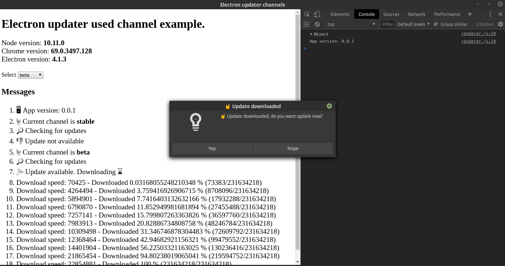

# Electron auto updater with channels example

This example running on **Linux** only, but must work with **Windows** or **MacOS** correctly

<p align="center">
  
</p>

## Try it
Version is `0.0.1` from package.json.
Change version in package.json `0.0.2` and build.
For beta channel add prefix **-beta** in package.json version (`0.0.3-beta/0.0.3-beta.1`) and build again.
This example working with 2 channels - stable and beta

## Powered by
- **Building process:** [`electron-builder`](https://github.com/electron-userland/electron-builder)
- **Local server for releases:** [`http://127.0.0.1:3000`] (default port is **3000**)

## Use it

```bash
# Clone this repository
git clone https://github.com/borisbutenko/electron-updater-channels.git
# Go into the repository
cd electron-updater-channels
# Install dependencies
yarn install
# Run server
yarn serve
# Build stable
yarn dist
# Build beta
yarn dist:beta
```

Go to folder `/server/releases/stable` or `/server/releases/beta` and run the `.AppImage` application

**P.S.**
For correct work, so that autoUpdater does not replace the startup file, I advise you to move the launcher to any other folder
